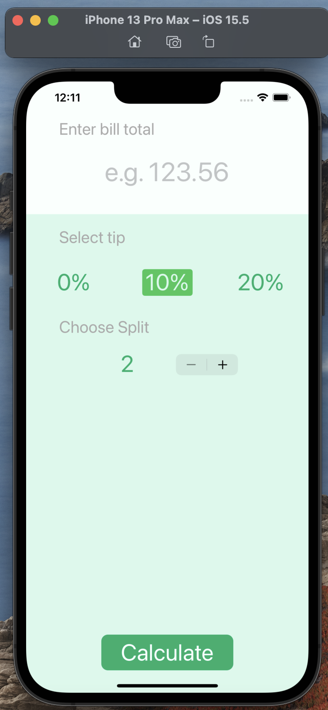

isSelected 
===

정의 : 컨트롤이 select 되어있는지의 여부를 확인하는 Bool 값이다.   

```swift

var isSelected: Bool { get set }

```
설명 : 이 속성의 값은 true 혹은 false를 선택할 수 있다. 새로 만든 컨트롤에 대한 값은 false이다.

예시 : 여러 개의 버튼이 있고 내가 누르는 버튼만 색이 바뀌고 누르지 않는 버튼은 기존의 색을 유지한다.




```swift

class CalculatorViewController: UIViewController {

@IBOutlet weak var zeroPctButton: UIButton! // 버튼 설정 
@IBOutlet weak var tenPctButton: UIButton!
@IBOutlet weak var twentyPctButton: UIButton!

@IBAction func tipChanged(_ sender: UIButton) {
        zeroPctButton.isSelected = false // 눌러져 있지 않은 상태
        tenPctButton.isSelected = false
        twentyPctButton.isSelected = false
        
        sender.isSelected = true // 호출하는 버튼이 눌러져 있는 상태이다. 
    }
}

```
