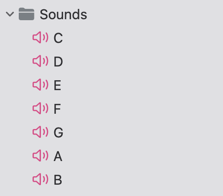
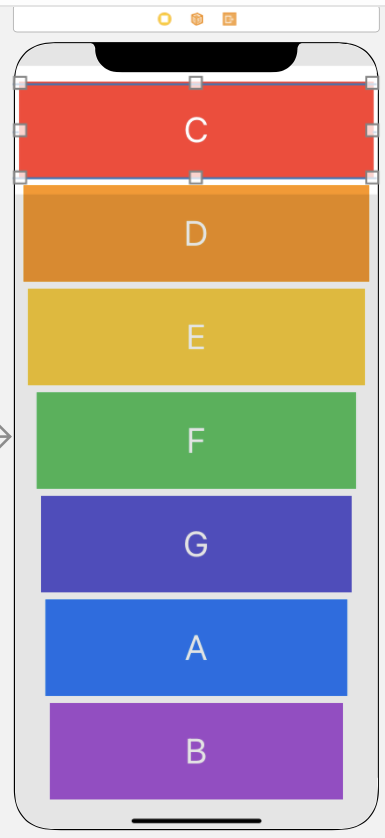

음원 집어넣기 
===

실로폰을 만들면서 Xcode에서 음원을 집어넣는 방법을 배웠다.   



이런 식으로 집어넣을 음원을 따로 폴더식으로 빼주면 된다.



해당 실로폰의 음을 만드는 코드를 짤 것이다. 

```swift 

import UIKit
import AVFoundation // 시간에 따른 미디어 재생, 생성할 수 있게 해주는 프레임워크
// 그리고 오디오를 처리하는 클래스가 따로 존재한다.   

class ViewController: UIViewController {
    
    var player: AVAudioPlayer! // 단순 음원 재생을 위한 코드 : AVAudioPlayer!
    
    override func viewDidLoad() {
        super.viewDidLoad()
    }
    
    @IBAction func keyPressed(_ sender: UIButton) { // 누르면 소리가 나는 버튼 
        playSound(soundName: sender.currentTitle!) // currentTitle은 버튼에 적혀있는 문자를 의미
    }   // currentTitle이 soundName에 들어감에 따라 파일이름이 되므로 현재 실로폰 각 버튼위에 적혀져 있는 문자 그대로 음원도 같은 문자를 가진 음원들이 각 버튼에 배치가 되므로 
    // c를 누르면 c.wav 소리가 나고 a를 누르면 a.wav 소리가 날 것이다.
    
    func playSound(soundName: String) { // 함수의 매개변수 이름을 soundNamed으로 짓고 String 형태로 지정
        let url = Bundle.main.url(forResource: soundName , withExtension: "wav") // forResourece는 파일 이름, withExtension은 파일 형식 
        player = try! AVAudioPlayer(contentsOf: url!) // 담아준 url 값을 player로 실행시켜줄 것이다. 
        player.play()
    }
}

```
